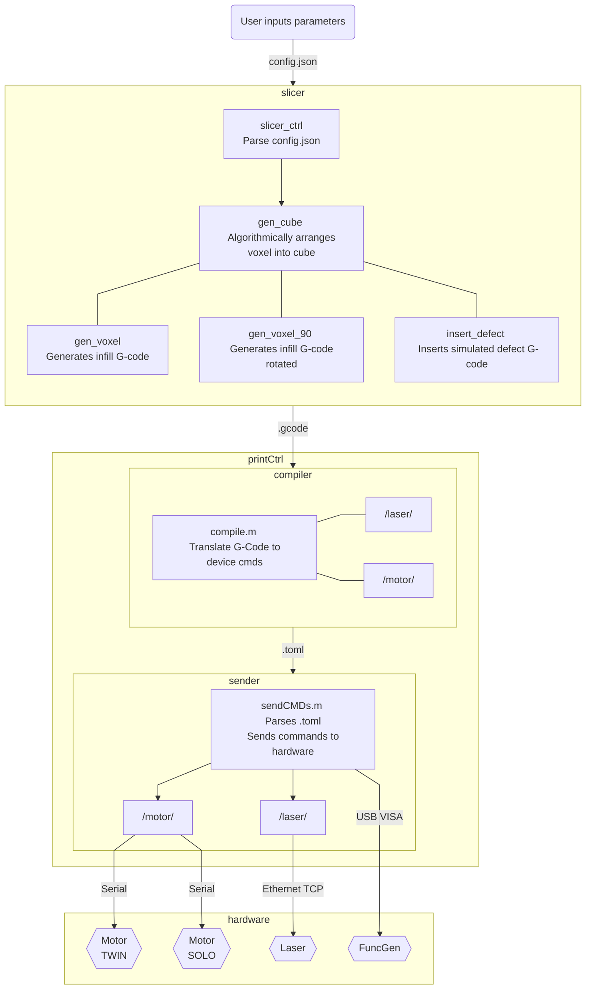
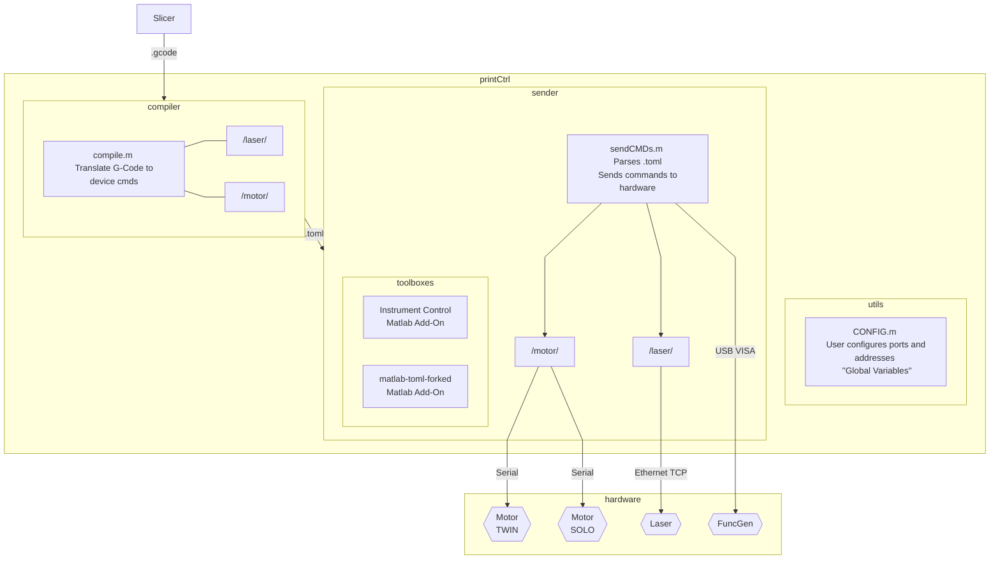
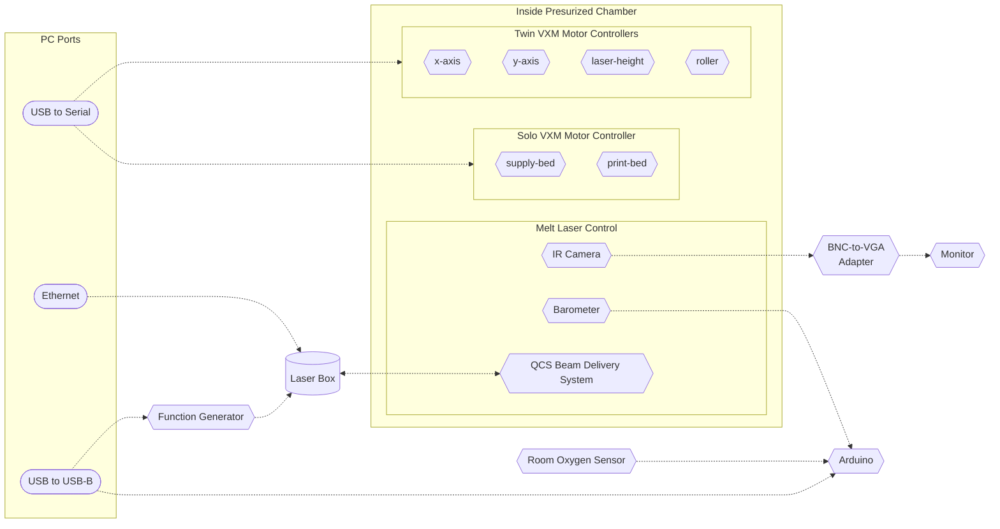

# 2021 Matlab 3D Metal Printer Software Diagrams #

This document uses [Markdown](https://www.markdownguide.org/basic-syntax/) with [Mermaid-js](https://mermaid-js.github.io/mermaid/#/) diagrams to render diagrams for our project. 

## Complete Block Diagram

## Detailed Printer Control Block Diagram ##

## Hardware Diagram ##
