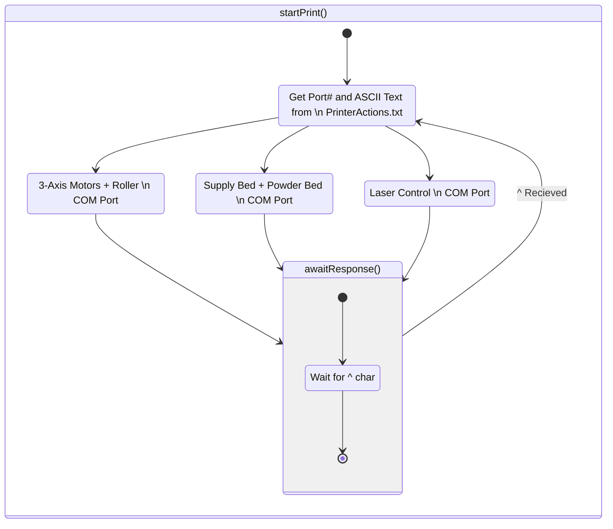
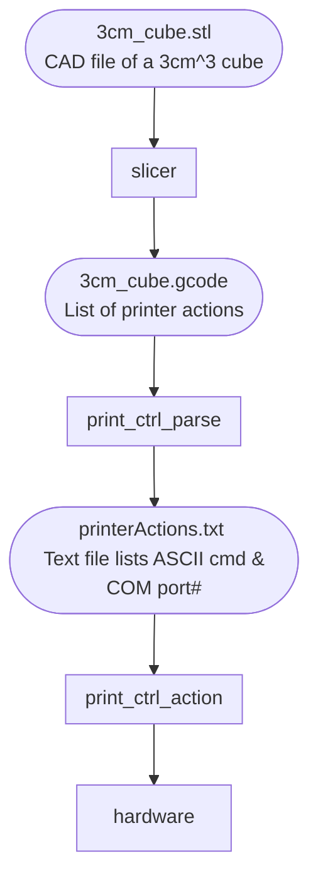

# New Software Flow 2021 #
## Matlab Software Flow ##

```mermaid
flowchart TB

    id1([3cm_cube.stl \n CAD file of a 3cm^3 cube]);
    id2([3cm_cube.gcode \n List of printer actions]);
    id3(["printerActions.txt \n Text file lists ASCII cmd & COM port#"]);
    
    subgraph slicer

        sl0["parse_stl() \n Reads .stl file"];
        sl1["gen_voxel() \n Slice each layer into v voxels"];
        sl2["gen_voxel_90_degrees() \n Slice each layer into v voxels"];
        sl3["gen_cube() \n Write an output gcode file"];
        sl0 -->|"0°"| sl1;
        sl0 -->|"90°"| sl2;
        sl1 & sl2 --> sl3;
    end

    subgraph print_ctrl_parse
        pca["parseGcode() \n gcode --> vxm or laser ASCII cmds"];
        pcb["verifyGcode() \n gcode --> vxm or laser ASCII cmds"];
        pca --> pcb;
    end

    subgraph print_ctrl_action
        pc2["startPrint() \n Sends cmds to hardware serially"];
        pc3["logAction() \n Await echo before sending new cmd"];
        pc2 --> pc3;
        pc3 --> pc2;
    end

    subgraph hardware
        subgraph COM ports
            hw1{{"3-axis motors \n roller"}};
            hw2{{"supply bed motor \n print bed motor"}};
            hw3{{"Laser"}};
            hw4{{"Arduino"}};
        end
    end

    id1 --> slicer --> id2 --> print_ctrl_parse --> id3 --> print_ctrl_action --> hardware;
    
```

## Hardware ##

```mermaid
flowchart LR
        subgraph Inside Presurized Chamber:
            subgraph axi[3-Axis Motors]
                ax1{{x-axis}};
                ax2{{y-axis}};
                ax3{{laser_height}};
                ax4{{roller}}
            end
            subgraph pbed[Bed Motors]
                pbed1{{supply_bed}};
                pbed2{{print_bed}};
            end
            subgraph Melt Laser Control
                ch1{{"IR Camera"}};
                ch2{{"Barometer"}};
                ch3{{"QCS BDS"}};
            end
        end

        lcs[("Laser Enclosure")];
        ox{{"Room Oxygen Sensor"}};
        Arduino{{"Arduino"}};

        subgraph PC Ports
            usb([USB])
            usbserial([USB-to-Serial])
            serial([Serial])
        end

        ch2 -.-> Arduino;
        ox -.-> Arduino;
        lcs <-.-> ch3;
        ch1 -.-> bncvga{{BNC-to-VGA\n Adapter}} -.-> m{{Monitor}};
        
        usb -.-> Arduino;
        usbserial -.-> axi;
         usbserial -.-> pbed;
        serial -.-> lcs;
```

## Printer Control State Diagram ##

```mermaid
stateDiagram-v2
    state startPrint() {
        state1: Get Port# and ASCII Text from \n PrinterActions.txt
        axis: 3-Axis Motors + Roller \n COM Port
        pbed: Supply Bed + Powder Bed \n COM Port
        lasr: Laser Control \n COM Port
        [*] --> state1
        state1 --> axis
        state1 --> pbed
        state1 --> lasr
        state awaitResponse() {
            charState: Wait for ^ char
            [*] --> charState
            charState --> [*]
        }
        axis --> awaitResponse()
        pbed --> awaitResponse()
        lasr --> awaitResponse()
        awaitResponse() --> state1 : ^ Recieved
    }

```

```mermaid
flowchart TB

    id1([3cm_cube.stl \n CAD file of a 3cm^3 cube]);
    id2([3cm_cube.gcode \n List of printer actions]);
    id3(["printerActions.txt \n Text file lists ASCII cmd & COM port#"]);
    
    subgraph slicer
    end

    subgraph print_ctrl_parse
    end

    subgraph print_ctrl_action
    end

    id1 --> slicer --> id2 --> print_ctrl_parse --> id3 --> print_ctrl_action --> hardware;
    
```