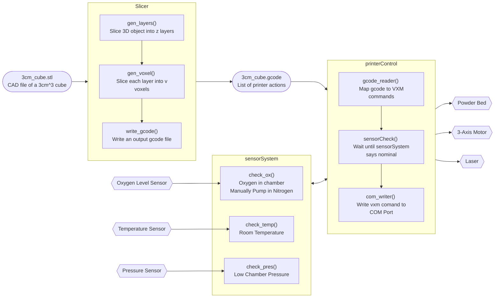

```mermaid
flowchart LR
    id1([3cm_cube.stl \n CAD file of a 3cm^3 cube]) 
    --> 
    Slicer
    
    subgraph Slicer
        sl1["gen_layers() \n Slice 3D object into z layers"] 
        -->
        sl2["gen_voxel() \n Slice each layer into v voxels"]
        -->
        sl3["write_gcode() \n Write an output gcode file"]
    end

    Slicer 
    --> 
    id2([3cm_cube.gcode \n List of printer actions])
    --> 
    printerControl

    subgraph printerControl
        pc1["gcode_reader() \n Map gcode to VXM commands"]
        -->
        pc2["sensorCheck() \n Wait until sensorSystem says nominal"]
        -->
        pc3["com_writer() \n Write vxm comand to COM Port"]
    end

    printerControl-->id3{{Powder Bed}}
    printerControl-->x{{3-Axis Motor}}
    printerControl-->y{{Laser}}

    id4{{Oxygen Level Sensor}} --> ss1
    id5{{Temperature Sensor}} --> ss2
    id6{{Pressure Sensor}} --> ss3

    subgraph sensorSystem
        ss1["check_ox() \n Oxygen in chamber \n Manually Pump in Nitrogen"]
        ss2["check_temp() \n Room Temperature"]
        ss3["check_pres() \n Low Chamber Pressure"]
    end

    sensorSystem
    <--> 
    printerControl
    
```