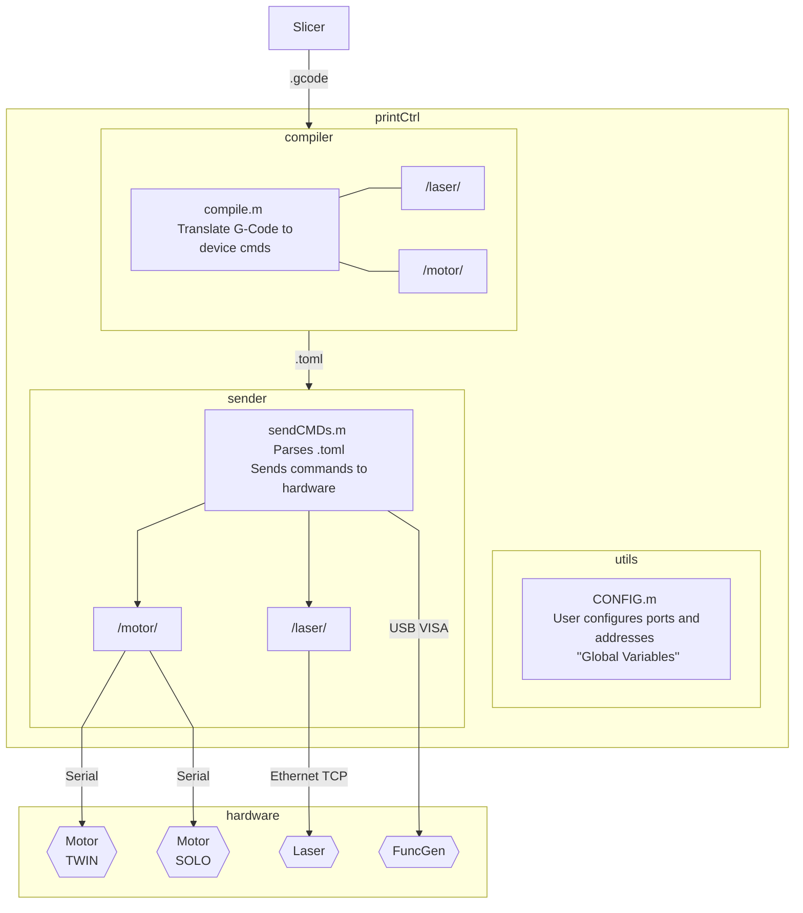

# Printer Control Documentation

## Prerequesites
Requirements as of 2021-12-02:

- Matlab 2020ba
- Instrument Control Toolbox - for Matlab 2020b (2021b+ is potentially incompatible)
- matlab-toml-forked - A fork of the matlab-toml Add-On.

## Overview
The Printer Control Unit handles most of the 3D Printer's functionality. 

The original PrinterControl software was written by a previous senior design group in Object Oriented C#. 
When re-writing the code in Matlab using procedural programming, we broke up the responsibilities of PrinterControl to be more modular.

The flow is very linear and is shown in the diagram below:
(If the diagram does not render, you can view it [here](https://i.imgur.com/VbOLSjU.png).)



## Directories
```
printCtrl
|   printCtrl.m
|
├───compiler
│   │   compile.m
│   │
│   ├───laser
│   │       getStatus.m
│   │       setLaserOff.m
│   │       setLaserOn.m
│   │
│   └───motor
│           homeAxisRoller.m
│           homeBeds.m
│           moveAxis.m
│           moveBeds.m
│           sweepRoller.m
│
├───sender
│   │   sendCMDs.m
│   │
│   ├───laser
│   │       executeLaser.m
│   │       readLaser.m
│   │       validLaserResp.m
│   │
│   └───motor
│           executeMotor.m
│           killMotors.m
│           stopMotors.m
│
├───toml
│       writeAction.m
│       writeHeader.m
│
└───utils
        arbWaveForm.m
        CONFIG.m
        freeLaserTCP.m
        freeMove.m
        freeVXMCMD.m
        getNumsFromStr.m
        printerHome.m
```

## printCtrl.m ##
`printCtrl.m` acts as a main() program. 
It simply wraps the slicer, compiler, sender, and some utility functions into a simple command line. 
It's good for creating and testing smaller g-code files and learning how the flow of the whole program works. 

```
>> printCtrl
At any time, press Ctrl+C to stop the program.
Enter one of the following commands:
   setup    to check connected devices.
   slice    to run slicer and generate .gcode
   compile  to compile .gcode into .toml
   test     to run testing functions
   send     to run the command sender
>> test
Enter one of the following commands:
   arbWaveForm     to test function generator.
   freeLaserTCP    to send a laser command
   freeMove        to test an individual motor
   freeVXMCMD      to run a VXM cmd (useful for -0 cmds)
   printerHome     to move the motors to home.
>> exit
Unknown command. Ending program.
>>
```

When you see `Enter one of the following commands:`, it means that the input is always going to be text:
```matlab
%% printCtrl.m line 13
    r = input(prompt, 's');
```
Commands that let you input functions or variables will usually give you examples:
```matlab
>> Enter the serial port E.g.('COM5' or CFG.PORT_TWIN): 
```

Note: As of the time of writing this, (2021-12-02) it is not fully tested and safety mechanisms are not fully implemented. 
Inputs are not always validated, which is useful because it lets developers respond to a prompt with a function. 
On the other hand, this can potentially be very dangerous, as Matlab is not type-safe. 
**An un-caught error while in the middle of a print could mean that the user would be unable to enter any inputs, and would have to manually shut off components.**

To try to allievate this, `printCtrl.m` is a script that only runs once and immediately returns. 
A good rule of thumb is to always double check, and manually skim through the file you are about to run. 

## /utils/ ##
`/utils/` contains an assortment of utilities for working with the hardware. 
The most notable of these are `CONFIG.m` and the `free*.m` functions.

`CONFIG.m` is designed to be manually edited by the user in order to change "global" variables. 
This can be useful if you unplug a cable and have the port number change on you.

`free*.m` functions let the user directly send commands such as moving the motors or turning on the targeting laser.
This is great for testing commands without having to go through the whole process of using the slicer, compiler, and sender.


### CONFIG.m ###
A function that contains "global constants" to be edited by the user and developer to set ports, addresses, step size, and other variables.

Developers should use this rather than explicitly stating port numbers and motor indexes.
**These values should always be constant during runtime, and should be treated as read-only.**

#### Usage
```matlab
    CFG = CONFIG();    % Instantiate the struct as CFG
```

Previously to move the supply bed motor, you would index motor 1, port COM11.
This can be troublesome because COM ports tend to change when plugging in USB-Serial cables in different ports.
```matlab
    % Use freemove function to move supplybed 500 steps:
    freeMove("COM11", 1, 500);
```

`CONFIG` gives these explicit names, so you can index `CFG.SUPPLYBED_VXM`, port `CFG.PORT_SOLO` instead.
```matlab
    % Use freemove function to move supplybed 500 steps:
    freeMove(CFG.PORT_SOLO, CFG.SUPPLYBED_VXM, 500);
```

#### Variables
`STEP_SIZE` 
Defines the size of one step.
The size of one VXM step is 0.0025mm.
1mm = 400 steps

Usage:
```matlab
    CFG = CONFIG();
    dist_in_mm = 2;
    dist_in_steps = dist_in_mm / CFG.STEP_SIZE;
    fprintf("%d steps = (%fmm) / (%fmm/step)\n", dist_in_steps, dist_in_mm, CFG.STEP_SIZE);
```
`>> 800 steps = (2mm) / (0.0025mm/step)`

`ZERO_X`, `ZERO_Y`, `ZERO_S`, `ZERO_P` 
Define absolute positions for the origin for usage in `homeAxisRoller()` and `homeBeds()`.
Some definitions from the perspective of the user looking into the chamber:

1. Origin: at the bottom left of the print bed.
2. X-axis: left(-) and right(+) movement.
3. Y-axis: forward/away(-) and backward/towards(+) movement.
4. Supply bed Z-axis: up(-) and down(+) movement.
5. Print bed Z-axis: up(-) and down(+) movement.

- ZERO_X -- X-axis motor zero position
    integer
    1800 steps from the right limit switch. (x mm from the left border of print bed)
- ZERO_Y -- Y-axis motor zero position
    integer
    13000 steps from the limit switch closest to the user. (y mm from the bottom border of print bed)
- ZERO_S -- Supply Bed motor zero position
    integer
    1800 steps above the limit switch position (any lower and powder could leak out) 
- ZERO_P -- Print Bed motor zero position
    integer
    Upper limit switch. (20cm up, but should stop at limit switch.)

### freeLaserTCP.m  ###
Utility function for sending commands directly to the laser.
Primarily used for toggling the targeting laser.
Returns the response from the laser.

#### Usage:
```matlab
    % Using CONFIG variables:
    CFG = CONFIG();
    freeLaserTCP(CFG.IP_LASER, CFG.PORT_LASER, setLaserOff());

    % Using manual input:
    cmdarr = uint8([0x1B, 0x02, 0x10, 0x00, 0x0D]);
    crc = sum(cmdarr);
    cmdarr = [cmdarr, crc];
    freeLaserTCP("169.254.198.107", 58176, cmdarr);
```

#### Variables
- `ip` -- IP Address of the laser
    string or character vector
- `port` -- Port number
    integer
- `cmdArray` -- array of bytes to be sent to the laser
    uint8 byte array
    Must start with 0x1B
    2nd to last byte in array must be the end byte 0x0D
    CRC byte must be sum of all bytes from startbyte to endbyte.

### freeMove.m  ###
Utility function which opens a com port, then moves the given motor a given distance in steps.
Uses the standard move command ImMx, where m is the motor index, and x is the distance in steps.
The function will continue to read until it recieves a '^' character, indicating termination or until it times out.
Returns the response from the VXM motor controller.

#### Usage:
```matlab
    % Using CONFIG variables:
    CFG = CONFIG();
    % Use freemove function to move motor 3, 500 steps:
    freeMove(CFG.PORT_TWIN, CFG.XAXIS_VXM, 500);

    % Using manual input:
    freeMove("COM5", 2, 500);
```

#### Variables
- `port` -- Serial port string
    string
    E.g. "COM5"
- `motornum` -- VXM Motor index
    positive int between 1-4
    Indexes depend on which motor controller is accessed.
    See CONFIG for details.
- `dist_in_steps` -- Distance to move the indexed motor in steps
    integer
    0, or large positive numbers will just move the motor in the positive direction until it hits the limit switch.
    Because -0 == 0 in Matlab, use a large negative number like -50000 to hit the negative limit switch.

### freeVXMCMD.m  ###
Utility function which opens a com port, then runs the VXM command.
Will send any ASCII command to the VXM motor controllers without any validation.
The function will continue to read until it recieves a '^' character, indicating termination or until it times out.
Returns the response from the VXM motor controller.

#### Usage:
```matlab
    % Using CONFIG variables:
    CFG = CONFIG();
    % Use freemove function to test sweepRoller() compiler function
    freeVXMCMD(CFG.PORT_TWIN, sweepRoller());

    % Using manual input:
    % Access COM5. Move motor 2 -500 steps 
    cmd = sprintf("F, C, I2M -500, R\r");
    freeVXMCMD("COM5", cmd);
```

#### Variables
- `port` -- Serial port string
    string
    E.g. "COM5"
- `cmdString` -- String of ASCII text to send to be sent
    integer
    See /docs/vxm/vxm2_users_man.pdf for reference

### arbWaveForm.m  ###
Utility script that turns on the function generator output for 5 seconds, then turns it back off.
Used for confirming that the function generator works.

**Note: This script hard-codes ports and addresses, so they will have to be manually configured.**

#### Prerequesites
The version of Matlab running on the machine at ASC2 uses **Matlab2020b** with the **Instrument Control Toolbox**.

Matlab2021b deprecated the `visa` command, and replaced it with `visadev`. 
If you plan on updating the machine past 2020b, please review this: 
[https://www.mathworks.com/help/instrument/transition-your-code-to-visadev-interface.html]

### printerHome.m ###
Utility script to move the axis and bed motors to the defined zero or home position.
Commands are hard coded for general use without the compiler.

### getNumsFromStr.m ###
Helper function that extracts numbers from a string using regex.
Returns an array of all the strings found.
[https://www.mathworks.com/matlabcentral/answers/44049-extract-numbers-from-mixed-string]

#### Variables
- `str` -- input string
    string

## /compiler/

`/compiler/` contains the compiler and it's helper functions for translating G-Code into commands for the motor, laser, and function generator. 
These commands are placed into a [`.toml` file](https://toml.io/en/) for usage by the sender `sendCMDs.m`.

### compile.m ###
Function that, given the location to a .gcode file and an output location, writes a `.toml` file with commands for use with `sendCMDs()`.

The G-Code file must always start with a width and height:
```gcode
Width: 30 Length: 30
```

Each line of g-code is mapped to a command for the motor controllers, laser, and function generator.

Supported g-code commands:
```gcode
    G01 X{x} Y{y} ; Move 3-axis motors to x,y
    G01 Z{z}      ; Increment Print Bed and Decrement Supply Bed by z, then sweep roller
    M200          ; Reset all motors to defined zero
    M201          ; Laser On
    M202          ; Laser Off
    M302          ; FuncGen On
    M303          ; FuncGen Off
```

#### Usage:
```matlab
compile("./testFiles/small.gcode", "./testFiles/small.toml");
```
#### Variables
- `inputfile` -- Location of the input file
    file location string
- `outputfile` -- Location of the output file
    file location string
    If the file doesn't exist, a new file will be created.

<!-- ### /compiler/motor/ ###
### /compiler/laser/ ### -->

## /toml/ ##
Contains a few helper functions for working with [TOML]() files.
Right now there are only 2 functions, and they only interact with the compiler.
This section will be used for documentation of anything that has to do with TOML.

The main reason we use 

Only certain TOML syntax is implemented with `sendCMDs()`.
For example, comments starting with # are not properly parsed yet.
See `/testFiles/` for examples of valid TOML files.

### [matlab-toml-forked](https://git.ece.iastate.edu/asmartin/matlab-toml) ###
This is an Matlab Add-On for reading and writing TOML.
The original matlab-toml Add-On was written by github user *g-s-k* that can be found in the Matlab Add-Ons explorer was very buggy and lacked support for other syntax.

### writeHeader.m ###
Helper function that writes a header for the TOML file specifying some assorted information.

Example result from `/testFiles/basics.toml`:
```toml
[Info]
datetime = '02-Dec-2021 12:17:34'
gcodepath = './testFiles/basics.gcode'
width = '30'
length = '30'
numDefects = '0'
```

#### Unfinished
- All of the header information is only for the user right now.
    None of it is programatically accessed.
- Right now, `numDefects` is not implemented, because our G-code files don't specify defect location.
- Does not use the matlab-toml-forked Add-On to generate TOML

#### Usage:
```matlab
% Line 52 of compile.m
    fileID = fopen(outputfile, 'w');
    writeHeader(fileID, inputfile, objWidth, objLength, numDefects);
```

#### Variables
- `fid` -- fileID to write to
    fileID
    returned from `fopen()`
- `gcodepath` -- Path to `.gcode` file that generated this `.toml`
    file location string
- `w` -- width of the object
    positive integer
- `l` -- length of the object
    positive integer
- `numDefects` -- unused, can set to any number
    integer

### writeAction.m ###
Writes a printerAction TOML table entry to the specified file.

#### Usage:
```matlab
    outputfile = "./testFiles/example.toml";
    fileID = fopen(outputfile, 'w');
    % Motor example:
    writeAction(fileID, 1, "Motor", "COM1", cmds, curLine);
    % Laser example:

```

**Motor example result** from `/testFiles/basics.toml` line 8:
```toml
[[printerAction]]
index = 1
device = 'Motor'
port = 'COM5'
actions = [
	'F, C, S4 M5400, I4 M0, R,',
	'F, C, S1 M5400, I1 M-0, R,',
	'F, C, S2 M5400, S3 M5400, I2 M0, I3 M-0, R,',
	'F, C, I2 M-1800, I3 M13000, R,',
]
gcode = 'M200'
```
**Laser example result** from `/testFiles/basics.toml` line 112:
```toml
[[printerAction]]
index = 12
device = 'Laser'
port = 58176
actions = [
	0x1B,
	0x02,
	0x10,
	0x01,
	0x0D,
	0x3B,
]
gcode = 'M201'
```

#### Variables
- `str` -- input string
    string

## /sender/ ##

#### Usage:
```matlab
```
#### Variables
- `str` -- input string
    string

### sendCMDs.m ###

#### Usage:
```matlab
```
#### Variables
- `str` -- input string
    string

<!-- ### /sender/motor/ ###
### /sender/laser/ ### -->

