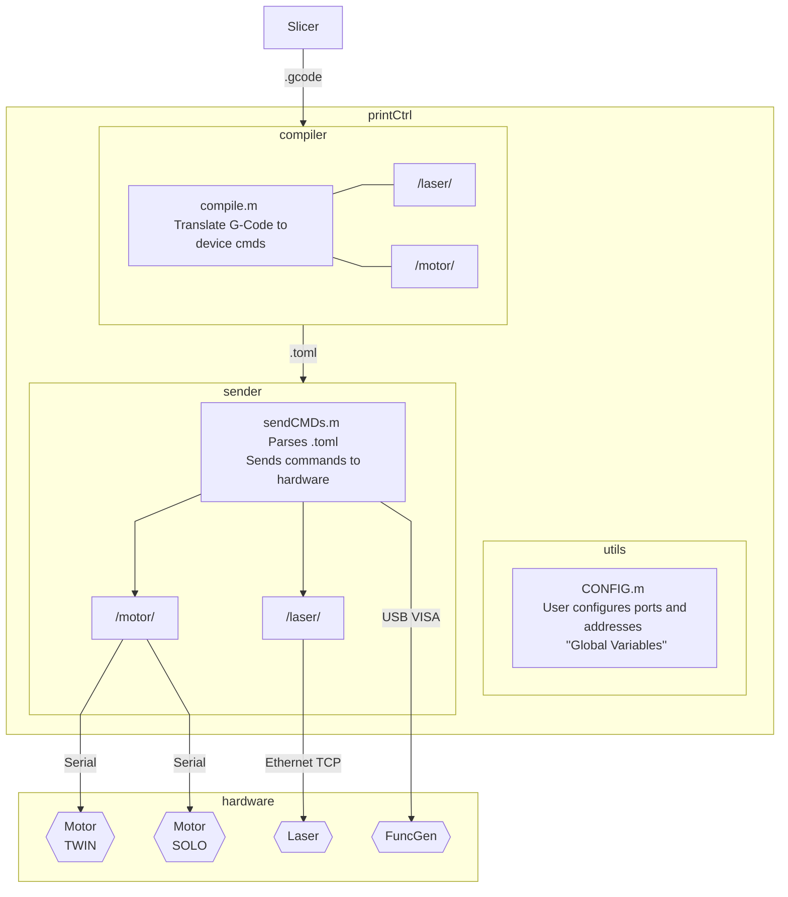

# Printer Control Documentation

## Prerequesites

Requirements as of 2021-12-02:

- Matlab 2020ba
- Instrument Control Toolbox - for Matlab 2020b (2021b+ is potentially incompatible)
- matlab-toml-forked - A fork of the matlab-toml Add-On written in-house.

## Overview

The Printer Control Unit handles most of the 3D Printer's functionality. 

The original PrinterControl software was written by a previous senior design group in Object Oriented C#. When re-writing the code in Matlab using procedural programming, we broke up the responsibilities of PrinterControl to be more modular.

The flow is very linear and is shown in the diagram below:
(If the diagram does not render, you can view it [here](https://i.imgur.com/VbOLSjU.png).)



## Directories

```
printCtrl
|   printCtrl.m
|
├───compiler
│   │   compile.m
│   │
│   ├───laser
│   │       getStatus.m
│   │       setLaserOff.m
│   │       setLaserOn.m
│   │
│   └───motor
│           homeAxisRoller.m
│           homeBeds.m
│           moveAxis.m
│           moveBeds.m
│           sweepRoller.m
│
├───sender
│   │   sendCMDs.m
│   │
│   ├───laser
│   │       executeLaser.m
│   │       readLaser.m
│   │       validLaserResp.m
│   │
│   └───motor
│           executeMotor.m
│           killMotors.m
│           stopMotors.m
│
├───toml
│       writeAction.m
│       writeHeader.m
│
└───utils
        arbWaveForm.m
        CONFIG.m
        freeLaserTCP.m
        freeMove.m
        freeVXMCMD.m
        getNumsFromStr.m
        printerHome.m
```

## printCtrl.m ##

## /utils/ ##

`/utils/` contains various 

### CONFIG ###

"Global constants" to be edited by the user and developer to set ports, addresses, step size, and other variables.
Developers should use this rather than explicitly stating port numbers and motor indexes.

Example usage in Matlab code:
```matlab
    CFG = CONFIG();    % Instantiate the struct as CFG
```

Previously to move the supply bed motor, you would index motor 1, port COM11.
This can be troublesome because COM ports tend to change when plugging in USB-Serial cables in different ports.
```matlab
    % Use freemove function to move supplybed 500 steps:
    freeMove("COM11", 1, 500);
```

`CONFIG` gives these explicit names, so you can index `CFG.SUPPLYBED_VXM`, port `CFG.PORT_SOLO` instead.
```matlab
    % Use freemove function to move supplybed 500 steps:
    freeMove(`CFG.PORT_SOLO`, `CFG.SUPPLYBED_VXM`, 500);
```

`STEP_SIZE` defines the size of one step.
As of the time of writing this, the size of one VXM step is 0.0025mm.
1mm = 400 steps
Example usage:
```matlab
    dist_in_mm = 2;
    dist_in_steps = dist_in_mm / CFG.STEP_SIZE;
    fprintf("%d steps = (%fmm) / (%fmm/step)\n", dist_in_steps, dist_in_mm, CFG.STEP_SIZE);
```
`>> 800 steps = (2mm) / (0.0025mm/step)`

`ZERO_X`, `ZERO_Y`, `ZERO_S,` `ZERO_P` define absolute positions for the origin for usage in `homeAxisRoller()` and `homeBeds()`.
From the perspective of the user looking into the chamber:
We place the origin at the bottom left of the print bed.

X-axis: left(-) and right(+) movement.
Y-axis: forward/away(-) and backward/towards(+) movement.
supply bed Z-axis: up(-) and down(+) movement.
print bed Z-axis: up(-) and down(+) movement.

ZERO_X - 1800 steps from the right limit switch. (x mm from the left border of print bed)
ZERO_Y - 13000 steps from the limit switch closest to the user. (y mm from the bottom border of print bed)
ZERO_S - 1800 steps above the limit switch position (any lower and powder could leak out) 
ZERO_P - Upper limit switch. (20cm up, but should stop at limit switch.)

## /compiler/

`/compiler/` contains the compiler and it's helper functions for translating G-Code into commands for the motor, laser, and function generator. These commands are placed into a [`.toml` file](https://toml.io/en/).

### `compile.m` ###

### `/compiler/motor/` ###

### `/compiler/laser/` ###

## /sender/ ##

### `sendCMDs.m` ###

### `/sender/motor/` ###

### `/sender/laser/` ###

## /toml/ ##

