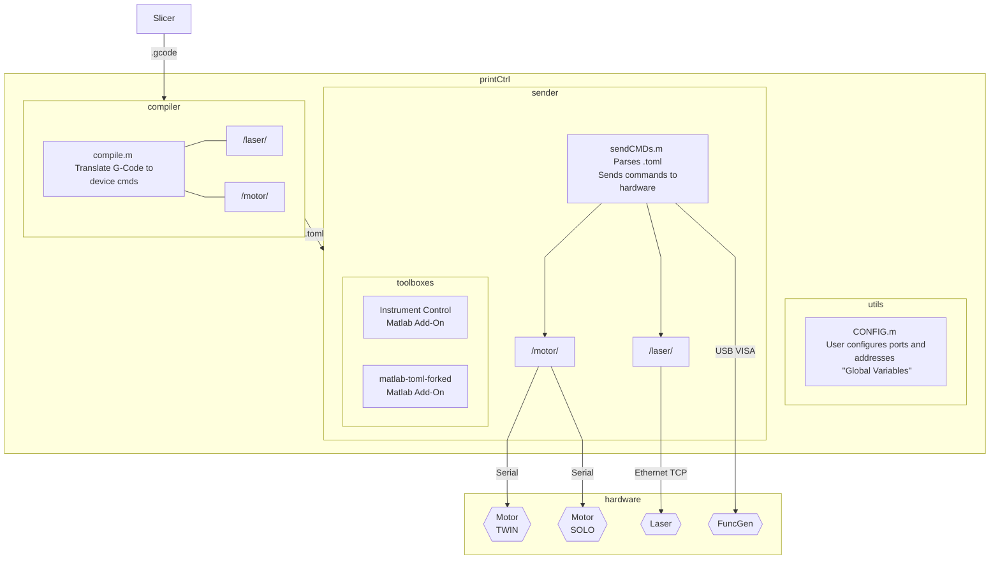

# Printer Control Documentation

## Table of Contents
- [Printer Control Documentation](#printer-control-documentation)
  - [Table of Contents](#table-of-contents)
  - [Prerequesites](#prerequesites)
  - [Overview](#overview)
  - [Directories](#directories)
  - [printCtrl.m](#printctrlm)
  - [/utils/](#utils)
    - [CONFIG.m](#configm)
      - [Usage](#usage)
      - [Variables](#variables)
    - [freeLaserTCP.m](#freelasertcpm)
      - [Usage](#usage-1)
      - [Variables](#variables-1)
    - [freeMove.m](#freemovem)
      - [Usage](#usage-2)
      - [Variables](#variables-2)
    - [freeVXMCMD.m](#freevxmcmdm)
      - [Usage](#usage-3)
      - [Variables](#variables-3)
    - [arbWaveForm.m](#arbwaveformm)
      - [Usage](#usage-4)
      - [Prerequesites](#prerequesites-1)
    - [printerHome.m](#printerhomem)
    - [getNumsFromStr.m](#getnumsfromstrm)
      - [Variables](#variables-4)
  - [/compiler/](#compiler)
    - [compile.m](#compilem)
      - [Usage](#usage-5)
      - [Variables](#variables-5)
  - [/compiler/laser/](#compilerlaser)
    - [setLaserOn.m](#setlaseronm)
      - [Usage](#usage-6)
    - [setLaserOff.m](#setlaseroffm)
      - [Usage](#usage-7)
  - [/compiler/motor/](#compilermotor)
    - [homeBeds.m](#homebedsm)
      - [Usage](#usage-8)
    - [moveAxis.m](#moveaxism)
      - [Unfinished](#unfinished)
      - [Usage](#usage-9)
      - [Variables](#variables-6)
    - [moveBeds.m](#movebedsm)
      - [Unfinished](#unfinished-1)
      - [Usage](#usage-10)
      - [Variables](#variables-7)
    - [sweepRoller.m](#sweeprollerm)
      - [Usage](#usage-11)
  - [/toml/](#toml)
    - [matlab-toml-forked](#matlab-toml-forked)
    - [writeHeader.m](#writeheaderm)
      - [Unfinished](#unfinished-2)
      - [Usage](#usage-12)
      - [Variables](#variables-8)
    - [writeAction.m](#writeactionm)
      - [Unfinished](#unfinished-3)
      - [Usage](#usage-13)
      - [Variables](#variables-9)
  - [/sender/](#sender)
    - [sendCMDs.m](#sendcmdsm)
      - [Prerequesites](#prerequesites-2)
      - [Unfinished](#unfinished-4)
      - [Usage](#usage-14)
      - [Variables](#variables-10)
  - [/sender/laser/](#senderlaser)
    - [executeLaser.m](#executelaserm)
      - [Unfinished](#unfinished-5)
      - [Usage](#usage-15)
      - [Variables](#variables-11)
    - [readLaser.m](#readlaserm)
      - [Usage](#usage-16)
      - [Variables](#variables-12)
    - [validLaserResp.m](#validlaserrespm)
      - [Unfinished](#unfinished-6)
      - [Usage](#usage-17)
      - [Variables](#variables-13)
  - [/sender/motor/](#sendermotor)
    - [executeMotor.m](#executemotorm)
      - [Usage](#usage-18)
      - [Variables](#variables-14)
    - [killMotors.m](#killmotorsm)
      - [Usage](#usage-19)
      - [Variables](#variables-15)
    - [stopMotors.m](#stopmotorsm)
      - [Usage](#usage-20)
      - [Variables](#variables-16)

## Prerequesites
Requirements as of 2021-12-02:

- Matlab 2020ba
- Instrument Control Toolbox - for Matlab 2020b (2021b+ is potentially incompatible)
- [matlab-toml-forked](https://git.ece.iastate.edu/asmartin/matlab-toml) - A fork of the matlab-toml Add-On.

## Overview
The Printer Control Unit handles most of the 3D Printer's functionality. 

The original PrinterControl software was written by a previous senior design group in Object Oriented C#. 
When re-writing the code in Matlab using procedural programming, we broke up the responsibilities of PrinterControl to be more modular, so individual parts of the printCtrl can be run indpendently of others.

1. The user configures ports and addresses in `CONFIG.m`
   
2. `compile.m` parses G-Code into a list of commands for various devices.
    The results are placed into a TOML text file.
    - ASCII strings for VXM Motor Controllers
    - Uint8 Byte arrays for the SPI Laser

3. `sendCMDs.m` reads the TOML file, and sends commands to devices one at a time.

The flow is very linear and is shown in the diagram below.
(If the diagram does not render, you can [view it here.](https://i.imgur.com/C6GH0pd.png))


## Directories
```
printCtrl
|   printCtrl.m
|
├───compiler
│   │   compile.m
│   │
│   ├───laser
│   │       setLaserOff.m
│   │       setLaserOn.m
│   │
│   └───motor
│           homeAxisRoller.m
│           homeBeds.m
│           moveAxis.m
│           moveBeds.m
│           sweepRoller.m
│
├───sender
│   │   sendCMDs.m
│   │
│   ├───laser
│   │       executeLaser.m
│   │       readLaser.m
│   │       validLaserResp.m
│   │
│   └───motor
│           executeMotor.m
│           killMotors.m
│           stopMotors.m
│
├───toml
│       writeAction.m
│       writeHeader.m
│
└───utils
        arbWaveForm.m
        CONFIG.m
        freeLaserTCP.m
        freeMove.m
        freeVXMCMD.m
        getNumsFromStr.m
        printerHome.m
```

## printCtrl.m ##
`printCtrl.m` acts as a main() program. 
It simply wraps the slicer, compiler, sender, and some utility functions into a simple command line. 
It's good for creating and testing smaller g-code files and learning how the flow of the whole program works. 

```
>> printCtrl
At any time, press Ctrl+C to stop the program.
Enter one of the following commands:
   setup    to check connected devices.
   slice    to run slicer and generate .gcode
   compile  to compile .gcode into .toml
   test     to run testing functions
   send     to run the command sender
>> test
Enter one of the following commands:
   arbWaveForm     to test function generator.
   freeLaserTCP    to send a laser command
   freeMove        to test an individual motor
   freeVXMCMD      to run a VXM cmd (useful for -0 cmds)
   printerHome     to move the motors to home.
>> exit
Unknown command. Ending program.
>>
```

When you see `Enter one of the following commands:`, it means that the input is always going to be text:
```matlab
%% printCtrl.m line 13
    r = input(prompt, 's');
```
Commands that let you input functions or variables will usually give you examples:
```matlab
>> Enter the serial port E.g.('COM5' or CFG.PORT_TWIN): 
```

Note: As of the time of writing this, (2021-12-02) it is not fully tested and safety mechanisms are not fully implemented. 
Inputs are not always validated, which is useful because it lets developers respond to a prompt with a function. 
On the other hand, this can potentially be very dangerous, as Matlab is not type-safe. 
**An un-caught error while in the middle of a print could mean that the user would be unable to enter any inputs, and would have to manually shut off components.**

To try to allievate this, `printCtrl.m` is a script that only runs once and immediately returns. 
A good rule of thumb is to always double check, and manually skim through the file you are about to run. 

## /utils/ ##
`/utils/` contains an assortment of utilities for working with the hardware. 
The most notable of these are `CONFIG.m` and the `free*.m` functions.

`CONFIG.m` is designed to be manually edited by the user in order to change "global" variables. 
This can be useful if you unplug a cable and have the port number change on you.

`free*.m` functions let the user directly send commands such as moving the motors or turning on the targeting laser.
This is great for testing commands without having to go through the whole process of using the slicer, compiler, and sender.


### CONFIG.m ###
A function that contains "global constants" to be edited by the user and developer to set ports, addresses, step size, and other variables.

Developers should use this rather than explicitly stating port numbers and motor indexes.
**These values should always be constant during runtime, and should be treated as read-only.**

#### Usage
```matlab
    CFG = CONFIG();    % Instantiate the struct as CFG
```

Previously to move the supply bed motor, you would index motor 1, port COM11.
This can be troublesome because COM ports tend to change when plugging in USB-Serial cables in different ports.
```matlab
    % Use freemove function to move supplybed 500 steps:
    freeMove("COM11", 1, 500);
```

`CONFIG` gives these explicit names, so you can index `CFG.SUPPLYBED_VXM`, port `CFG.PORT_SOLO` instead.
```matlab
    % Use freemove function to move supplybed 500 steps:
    freeMove(CFG.PORT_SOLO, CFG.SUPPLYBED_VXM, 500);
```

#### Variables
`STEP_SIZE` 
Defines the size of one step.
The size of one VXM step is 0.0025mm.
1mm = 400 steps
```matlab
    CFG = CONFIG();
    dist_in_mm = 2;
    dist_in_steps = dist_in_mm / CFG.STEP_SIZE;
    fprintf("%d steps = (%fmm) / (%fmm/step)\n", dist_in_steps, dist_in_mm, CFG.STEP_SIZE);
```
`>> 800 steps = (2mm) / (0.0025mm/step)`

`ZERO_X`, `ZERO_Y`, `ZERO_S`, `ZERO_P` 
Define absolute positions for the origin for usage in `homeAxisRoller()` and `homeBeds()`.
Some definitions from the perspective of the user looking into the chamber:

1. Origin: at the bottom left of the print bed.
2. X-axis: left(-) and right(+) movement.
3. Y-axis: forward/away(-) and backward/towards(+) movement.
4. Supply bed Z-axis: up(-) and down(+) movement.
5. Print bed Z-axis: up(-) and down(+) movement.

- `ZERO_X` -- X-axis motor zero position
    integer
    1800 steps from the right limit switch. (x mm from the left border of print bed)
- `ZERO_Y` -- Y-axis motor zero position
    integer
    13000 steps from the limit switch closest to the user. (y mm from the bottom border of print bed)
- `ZERO_S` -- Supply Bed motor zero position
    integer
    1800 steps above the limit switch position (any lower and powder could leak out) 
- `ZERO_P` -- Print Bed motor zero position
    integer
    Upper limit switch. (20cm up, but should stop at limit switch.)

### freeLaserTCP.m  ###
Utility function for sending commands directly to the laser.
Primarily used for toggling the targeting laser.
Returns the response from the laser.

#### Usage
```matlab
    % Using CONFIG variables:
    CFG = CONFIG();
    freeLaserTCP(CFG.IP_LASER, CFG.PORT_LASER, setLaserOff());

    % Using manual input:
    cmdarr = uint8([0x1B, 0x02, 0x10, 0x00, 0x0D]);
    crc = sum(cmdarr);
    cmdarr = [cmdarr, crc];
    freeLaserTCP("169.254.198.107", 58176, cmdarr);
```

#### Variables
- `ip` -- IP Address of the laser
    string or character vector
- `port` -- Port number
    integer
- `cmdArray` -- array of bytes to be sent to the laser
    uint8 byte array
    Must start with 0x1B
    2nd to last byte in array must be the end byte 0x0D
    CRC byte must be sum of all bytes from startbyte to endbyte.

### freeMove.m  ###
Utility function which opens a com port, then moves the given motor a given distance in steps.
Uses the standard move command ImMx, where m is the motor index, and x is the distance in steps.
The function will continue to read until it recieves a '^' character, indicating termination or until it times out.
Returns the response from the VXM motor controller.

#### Usage
```matlab
    % Using CONFIG variables:
    CFG = CONFIG();
    % Use freemove function to move motor 3, 500 steps:
    freeMove(CFG.PORT_TWIN, CFG.XAXIS_VXM, 500);

    % Using manual input:
    freeMove("COM5", 2, 500);
```

#### Variables
- `port` -- Serial port string
    string
    E.g. "COM5"
- `motornum` -- VXM Motor index
    positive int between 1-4
    Indexes depend on which motor controller is accessed.
    See CONFIG for details.
- `dist_in_steps` -- Distance to move the indexed motor in steps
    integer
    0, or large positive numbers will just move the motor in the positive direction until it hits the limit switch.
    Because -0 == 0 in Matlab, use a large negative number like -50000 to hit the negative limit switch.

### freeVXMCMD.m  ###
Utility function which opens a com port, then runs the VXM command.
Will send any ASCII command to the VXM motor controllers without any validation.
The function will continue to read until it recieves a '^' character, indicating termination or until it times out.
Returns the response from the VXM motor controller.

#### Usage
```matlab
    % Using CONFIG variables:
    CFG = CONFIG();
    % Use freemove function to test sweepRoller() compiler function
    freeVXMCMD(CFG.PORT_TWIN, sweepRoller());

    % Using manual input:
    % Access COM5. Move motor 2 -500 steps 
    cmd = sprintf("F, C, I2M -500, R\r");
    freeVXMCMD("COM5", cmd);
```

#### Variables
- `port` -- Serial port string
    string
    E.g. "COM5"
- `cmdString` -- String of ASCII text to send to be sent
    integer
    See /docs/vxm/vxm2_users_man.pdf for reference

### arbWaveForm.m  ###
Utility script that turns on the function generator output for 5 seconds, then turns it back off.
Used for confirming that the function generator works.

**Note: This script hard-codes ports and addresses, so they will have to be manually configured.**

#### Usage
```
>> arbWaveForm
```

#### Prerequesites
The version of Matlab running on the machine at ASC2 uses **Matlab2020b** with the **Instrument Control Toolbox**.

Matlab2021b deprecated the `visa` command, and replaced it with `visadev`. 
If you plan on updating the machine past 2020b, please review this: 
[https://www.mathworks.com/help/instrument/transition-your-code-to-visadev-interface.html]

### printerHome.m ###
Utility script to move the axis and bed motors to the defined zero or home position.
Commands are hard coded for general use without the compiler.

### getNumsFromStr.m ###
Helper function that extracts numbers from a string using regex.
Returns an array of all the strings found.
[https://www.mathworks.com/matlabcentral/answers/44049-extract-numbers-from-mixed-string]

#### Variables
- `str` -- input string
    string

## /compiler/ ##

`/compiler/` contains the compiler and it's helper functions for translating G-Code into commands for the motor, laser, and function generator. 
These commands are placed into a [`.toml` file](https://toml.io/en/) for usage by the sender `sendCMDs.m`.

### compile.m ###
Function that, given the location to a .gcode file and an output location, writes a `.toml` file with commands for use with `sendCMDs()`.

The G-Code file must always start with a width and height:
```gcode
Width: 30 Length: 30
```

Each line of g-code is mapped to a command for the motor controllers, laser, and function generator.

Supported g-code commands:
```gcode
    G01 X{x} Y{y} ; Move 3-axis motors to x,y
    G01 Z{z}      ; Increment Print Bed and Decrement Supply Bed by z, sweep roller
    M200          ; Reset all motors to defined zero
    M201          ; Laser On
    M202          ; Laser Off
    M302          ; FuncGen On
    M303          ; FuncGen Off
```

#### Usage
```matlab
compile("./testFiles/small.gcode", "./testFiles/small.toml");
```
#### Variables
- `inputfile` -- Location of the input file
    file location string
- `outputfile` -- Location of the output file
    file location string
    If the file doesn't exist, a new file will be created.


## /compiler/laser/ ##
Compiler helper functions which reutrn byte arrays for easy use.
Only the 0x02 targeting laser control command is implemented as of right now.
See R4 Laser Systems Customer Command Reference .pdf file for more information.

### setLaserOn.m ###
The M201 Laser On command maps to the uint8 byte array `1B, 02, 10, 01, 0D, 3B`.

#### Usage
```matlab
fprintf("%02X, ", setLaserOn());
```

### setLaserOff.m ###
The M201 Laser On command maps to the uint8 byte array `1B, 02, 10, 00, 0D, 3B`.

#### Usage
```matlab
fprintf("%02X, ", setLaserOff());
```

## /compiler/motor/ ##
Compiler helper functions which reutrn string arrays for easy use.
See vxm2_users_man.pdf for more details.

### homeBeds.m ###
Compiler subfunction which returns the command to move the beds to the defined home position in CONFIG.m.
First result is a command to move supply bed to positive zero, lower limit switch, and print bed to negative zero, upper limit switch.
Second command is to move to move the supply and print beds to `CFG.ZERO_S` and `CFG.ZERO_P` respectively.
Similar to `printerHome()`, but for the compiler and uses global constants to prevent hard-coding the values.

#### Usage
```matlab
str = homeBeds();
disp(str);
```
Command Window:
```
    "F, C, S1 M3000, S2 M3000, I1 M0, I2 M-0, R,"    "F, C, S1 M3000, S2 M3000, I1 M-1800, I2 M-50000, R,"
```

### moveAxis.m ###
Compiler subfunction which returns the command to move from previous point (x0, y0) to new point (x1, y1).
G-code units are in mm. The point (1, 1), is 1mm in the x and y direction.
VXM Command breakdown:
    "F, C, I2 M400, R"
    F = On-Line mode with echo off
    C = clear all commands from current program
    I2 M400 = Index motor 2, move 400 steps positive direction
    R = run command

#### Unfinished
- Does not prevent out of bounds movement
- Does not have configurable speeds due to C command clearing memory on each run

#### Usage
Movement commands are relative to the current position. 
```matlab
% Move from (0,0) to (1,1)
str = moveAxis(0,0, 1,1);
disp(str);
```
This results in 400 steps +x direction, 400 steps +y direction.
```
    F, C, (I2 M400, I3 M400), R,
```
Movements that are only in the X or only in the Y direction omit the unused movement command.
```matlab
% Move from (0,0) to (0,5)
str = moveAxis(0,0, 0,5);
disp(str);
```
This results in 2000 steps in the +y direction.
```
    F, C, I3 M2000, R,
```

#### Variables
- `x0` -- starting x position in mm coordinate grid
    float
- `y0` -- starting y position in mm coordinate grid
    float
- `x1` -- ending x position in mm coordinate grid
    float
- `y1` -- ending y position in mm coordinate grid
    float

### moveBeds.m ###
Compiler subfunction that returns the command to increment the supply bed and decrements the print bed by an elevation 'z'.
'z' is usually the height of a print layer.
The supply bed moves + int32(z / CFG.STEP_SIZE) steps. (up)
The print bed moves - int32(z / CFG.STEP_SIZE) steps. (down)

#### Unfinished
- Does not prevent out of bounds movement
- Does not allow for variable movement.
    Print and supply bed will always move the same amount of steps.

#### Usage
```matlab
% Move beds 3mm
str = moveBeds(3.0);
disp(str);
```
Command Window:
```
    "F, C, I1 M1200, I2 M-1200, R,"
```

#### Variables
- `z` -- starting x position in mm coordinate grid
    float

### sweepRoller.m ###
Compiler subfunction that generates the commands to sweep the roller left to right, hitting both limit switches in the process.

#### Usage
```matlab
str = sweepRoller();
disp(str);
```
Command Window:
```
    "F, C, I1 M0, R,"    "F, C, I1 M-0, R,"
```

## /toml/ ##
Contains a few helper functions for working with [TOML](https://toml.io/en/) files.
Right now there are only 2 functions, and they only interact with the compiler.
This section will be used for documentation of anything that has to do with TOML.

We use TOML files over JSON files because we want the user to be able to manually read through each command that is being sent to devices. 
Unlike JSON files, TOML supports hexadecimal, allowing us to format hex bytes into the text file.
Similar to JSON files, Matlab can programatically parse TOML using a bundled Add-On for the project called matlab-toml-forked.

### [matlab-toml-forked](https://git.ece.iastate.edu/asmartin/matlab-toml) ###
This is an Matlab Add-On for reading and writing TOML and is packaged in `matlab-toml-forked.mltbx`.

The original matlab-toml Add-On was written by github user *g-s-k* that can be found in the Matlab Add-Ons explorer was very buggy and lacked support for other syntax.
A [fork was made by gaetawoo](https://github.com/gaetawoo/matlab-toml), however, this also included a bug which broke when trying to handle hexadecimal byte arrays which was integral to our project.
This project includes a fixed version of gaetawoo's fork.

Only certain TOML syntax is implemented with `sendCMDs()`.
For example, comments starting with # are not properly parsed yet.
Also, one line array declarations are also not supported by `sendCMDs()`.
See `/testFiles/` for examples of valid TOML files.

### writeHeader.m ###
Helper function that writes a header for the TOML file specifying some assorted information.

Example result from `/testFiles/basics.toml`:
```toml
[Info]
datetime = '02-Dec-2021 12:17:34'
gcodepath = './testFiles/basics.gcode'
width = '30'
length = '30'
numDefects = '0'
```

#### Unfinished
- All of the header information is only for the user right now.
    None of it is programatically accessed.
    Ideally, the header should assist in validating out-of-bounds behavior when the sender is running.
- Right now, `numDefects` is not implemented, because our G-code files don't specify defect location.
- Does not use the matlab-toml-forked Add-On to generate TOML

#### Usage
```matlab
% Line 52 of compile.m
    fileID = fopen(outputfile, 'w');
    writeHeader(fileID, inputfile, objWidth, objLength, numDefects);
```

#### Variables
- `fid` -- fileID to write to
    fileID
    returned from `fopen()`
- `gcodepath` -- Path to `.gcode` file that generated this `.toml`
    file location string
- `w` -- width of the object
    positive integer
- `l` -- length of the object
    positive integer
- `numDefects` -- unused, can set to any number
    integer

### writeAction.m ###
Writes a printerAction TOML table entry to the specified file.

#### Unfinished
- Does not use the matlab-toml-forked Add-On to generate TOML
- Does not support one line arrays
- May want to make writing index keyval optional for quick editing

#### Usage
```matlab
    outputfile = "./testFiles/example.toml";
    fileID = fopen(outputfile, 'w');
    % Motor example:
    gcode = 'M200';
    cmds = homeAxisRoller();
    writeAction(fileID, 1, "Motor", "COM1", cmds, gcode);
    % Laser example:
    gcode = 'M201';
    cmds = setLaserOn();
    writeAction(fileID, 12, "Laser", 58176, cmds, gcode);
```

**Motor example result** from `/testFiles/basics.toml` line 8:
```toml
[[printerAction]]
index = 1
device = 'Motor'
port = 'COM5'
actions = [
	'F, C, S4 M5400, I4 M0, R,',
	'F, C, S1 M5400, I1 M-0, R,',
	'F, C, S2 M5400, S3 M5400, I2 M0, I3 M-0, R,',
	'F, C, I2 M-1800, I3 M13000, R,',
]
gcode = 'M200'
```
**Laser example result** from `/testFiles/basics.toml` line 112:
```toml
[[printerAction]]
index = 12
device = 'Laser'
port = 58176
actions = [
	0x1B,
	0x02,
	0x10,
	0x01,
	0x0D,
	0x3B,
]
gcode = 'M201'
```

#### Variables
- `fid` -- fileID to write to
    fileID
    returned from `fopen()`
- `idx` -- index of command
    positive integer
- `device` -- Device being used
    string
    can only be "Motor", "Laser" or "FuncGen"
- `port` -- port of the object
    string or positive integer
    should look like 'COM5' if Motor
    should look like 58176 if Laser
    should look like 'USB::...' if FuncGen
- `cmds` -- list of commands to be sent to device
    array of strings or byte array
    should be array of strings if device is Motor or FuncGen
    should be byte array if device is Laser
- `gcode` -- gcode that generated commands
    string

## /sender/ ##
`/sender/` contains the command sender `sendCMDs()` and it's helper functions for sending commands to the motor, laser, and function generator.

### sendCMDs.m ###
Parses and executes the instructions in the TOML file by sending commands to the motor controllers and the laser.

**Make sure that `CONFIG.m` has the proper port and address configurations before running.**

#### Prerequesites
- matlab-toml-forked toolbox
- Instrument Control Toolbox Matlabb 2020b

#### Unfinished
- Comments in certain areas, like in the middle of a `[[printerAction]]`, are not validated and could break the program.
- Other various safe programming techniques like type checking are not fully implemented.

#### Usage
```matlab
sendCMDs("./testFiles/home.toml")
```

#### Variables
- `inputfile` -- input file location
    file location string

## /sender/laser/ ##
Sender helper functions for laser control.

### executeLaser.m ###
Sends a TCP packet with the byte array to the Laser.

#### Unfinished
- Need to validate response as uint8.

#### Usage
```matlab
% Set the port
CFG = CONFIG();
laserTCPdevice = tcpclient(CFG.IP_LASER, CFG.PORT_LASER);

% Create a printerAction struct
pa.index = 1;
pa.device = 'Laser';
pa.port = CFG.PORT_LASER;
pa.actions = setLaserOn();
pa.gcode = 'M201';

executeLaser(pa, twinVXMdevice);
```

#### Variables
- `pa` -- printer action struct
    struct with these fields:
    `pa.index` - positive integer
    `pa.device` - string
    `pa.port` - positive integer
    `pa.actions` - uint8 byte array
    `pa.gcode` - string
- `tcpDevice` -- Matlab tcpclient
    generated from tcpclient();

### readLaser.m ###
Read bytes from device until we see the response terminator 0x0D.
See R4 Laser Systems Customer Command Reference .pdf file for more information.

#### Usage
```matlab
CFG = CONFIG();
laserTCPdevice = tcpclient(CFG.IP_LASER, CFG.PORT_LASER);

resp = readLaser(laserTCPdevice);
fprintf("0x%02X, ", resp);
```

#### Variables
- `device` -- Matlab tcpclient
    generated from tcpclient();

### validLaserResp.m ###
Validates the laser response.
The first byte must always be 0x1B.
The second byte must always be the number of cmd bytes + number of data bytes.
If the third byte is a zero, the 4th byte is an error code.
The second to last byte must always end with the terminator 0x0D.
The last byte must always be a CRC byte which is equal to the sum of all bytes from 0x1B to 0x0D.

#### Unfinished
- We don't properly parse non-error laser responses, as that was defined to be out of the scope of this project.

#### Usage
```matlab
CFG = CONFIG();
laserTCPdevice = tcpclient(CFG.IP_LASER, CFG.PORT_LASER);

resp = readLaser(laserTCPdevice);
validLaserResp(resp);
fprintf("0x%02X, ", resp);
```

#### Variables
- `respByteArr` -- Response packet from the laser
    Array of bytes

## /sender/motor/ ##
sender helper functions for motor control.
### executeMotor.m ###
Sends a command to one of the VXM motor controllers for execution.

#### Usage
```matlab
% Set the port
CFG = CONFIG();
twinVXMdevice = serialport(CFG.PORT_TWIN, CFG.BAUD_VXM);

% Get the struct from the TOML file
fileData = readlines("./testFiles/minHome.toml");
fileData = sprintf("%s\n", fileData);
pa = toml.decode(fileData);
% Unwrap nested object
pa = pa.printerAction;

executeMotor(pa, twinVXMdevice);
```

#### Variables
- `pa` -- printer action struct
    struct with these fields:
    `pa.index` - positive integer
    `pa.device` - string
    `pa.port` - string
    `pa.actions` - string array
    `pa.gcode` - string
- `serialDevice` -- Matlab serialport device
    generated from serialport();

### killMotors.m ###
Interrupts running motor commands.
Sends a kill command "K" to both serial ports connected to the VXM motors.
Can potentially cause problems if motorspeed > 1000 steps/second
See VXM-2 Users Manual for details

#### Usage
```matlab
% Create serial port devices
twinVXMdevice = serialport(CFG.PORT_TWIN, CFG.BAUD_VXM);
soloVXMdevice = serialport(CFG.PORT_SOLO, CFG.BAUD_VXM);

...

if problem
    killMotors(twinVXMdevice, soloVXMdevice);
end
```
#### Variables
- `serialTwin` -- Matlab serialport device for twin motors
    generated from `serialport(CFG.PORT_TWIN, CFG.BAUD_VXM);`
- `serialTwin` -- Matlab serialport device for twin motors
    generated from `serialport(CFG.PORT_SOLO, CFG.BAUD_VXM);`

### stopMotors.m ###
Interrupts running motor commands.
Sends a stop command "D" to both serial ports connected to the VXM motors.
Causes motors to decelerate to a stop. Safer than a kill command.
See VXM-2 Users Manual for details.

#### Usage
```matlab
% Create serial port devices
twinVXMdevice = serialport(CFG.PORT_TWIN, CFG.BAUD_VXM);
soloVXMdevice = serialport(CFG.PORT_SOLO, CFG.BAUD_VXM);

...

if problem
    stopMotors(twinVXMdevice, soloVXMdevice);
end
```
#### Variables
- `serialTwin` -- Matlab serialport device for twin motors
    generated from `serialport(CFG.PORT_TWIN, CFG.BAUD_VXM);`
- `serialTwin` -- Matlab serialport device for twin motors
    generated from `serialport(CFG.PORT_SOLO, CFG.BAUD_VXM);`