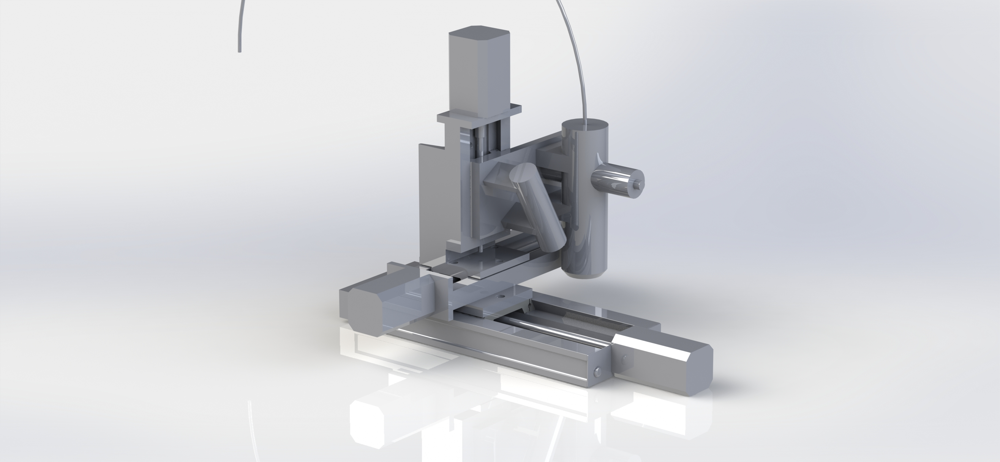
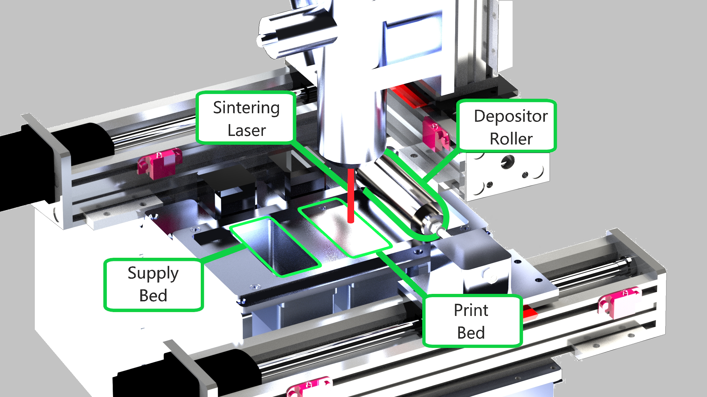
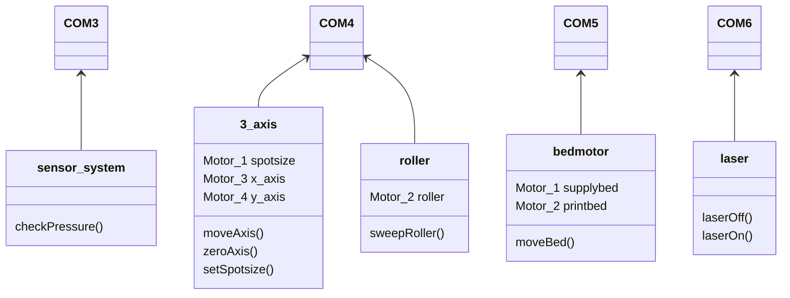

# Printer Control Unit ##

Everything within the `/print_ctrl/` directory relates to the functionality of the printer.
There are 3 things Printer Control has to do:

1. Translate the gcode into a printer action.
2. Manage Serial connections
    a. Motor Controllers
    b. Laser
    c. Arduino
3. Communicate whatever's going on to the user.


## 1. Translate gcode into a printer action `compile.m` ##

`01_parseGcode()` takes in the path to the `.gcode` file, and converts each line to an action the printer should take. The gcode file lists a series of points on a **milimeter** coordinate grid.

### Width and Height ###
Valid gcode files should always start with a line specifying it's width and height:
```
Width: 30 Length: 30
```

Define rectangle ABCD, which represents the borders of the phone.

### Move Axis Motor `/axis/` ###
The motors that control the movement of the laser are called _axis motors_.


We define left and right as `-x` and `+x`.
We define forward and back as `-y` and `+y`.

The `G01` command moves the current position to `(x, y)` and a constant speed. The `x` and `y` coordinates refer to a position on a milimeter coordinate grid.
```
G01 X{x} Y{y} = Move 3-axis roller to x,y
```
### Change Layer `/pbed/` ###


There are 3 motors that need to be managed to conduct a layer change:
1. Supply Bed Motor
    +z is up, -z is down
2. Print Bed Motor
    +z is up, -z is down
3. Depositior Roller
    +x is right, -x is left

The `G01` Command is reused here, because all of these motors are moved at a constant speed. z is used to specify the height of the desired layer in milimeters:
```
    G01 Z{z}      = Construct a layer change to an elevation z
```

We start by assuming the depositor roller is in it's default state, as far left as possible `(x = 0)`.
1. The supply bed moves up `(+z)` pushing powder out of it's supply container.
2. The print bed moves down `(-z)` so a new layer of powder can be laid onto the print surface.
3. The roller moves to right until it hits the limit switch `(+x)`, pushing the powder from the supply bed onto the print bed. Any leftovers are pushed into the overflow container.
4. The roller then resets to it's zero position `(x = 0)`.

### Laser On/Off `/laser/` ###
```
    M201          = Laser On
    M202          = Laser Off
```

## 2. Send print actions to serial ports `sendCMDs.m` ##

Note: Even though this is a class diagram, we are not using object oriented programming.


## 3. Log the output to the console `03_logAction.m` ##